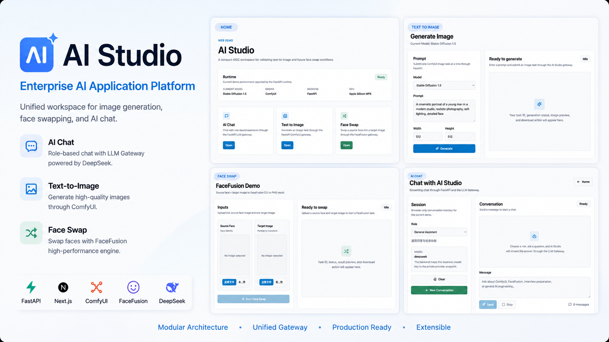
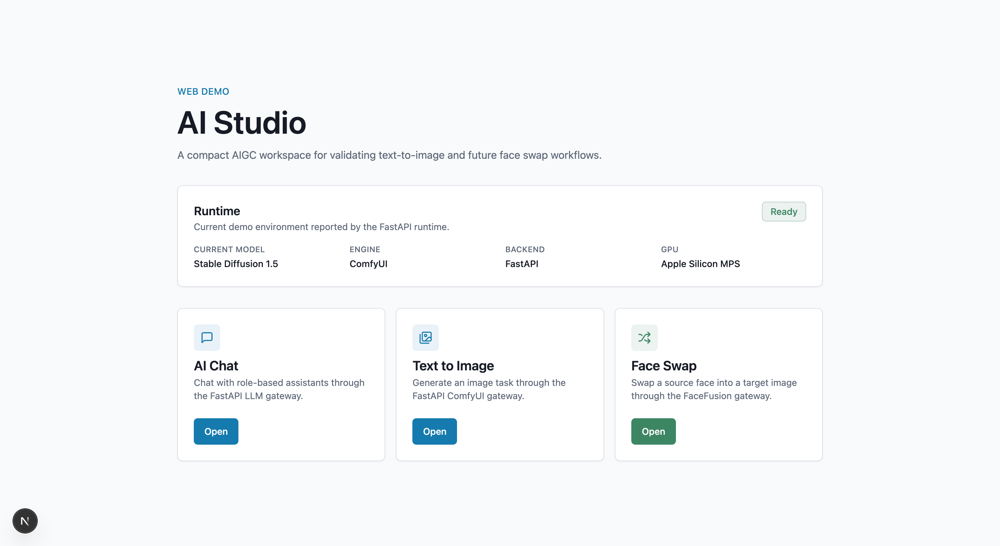
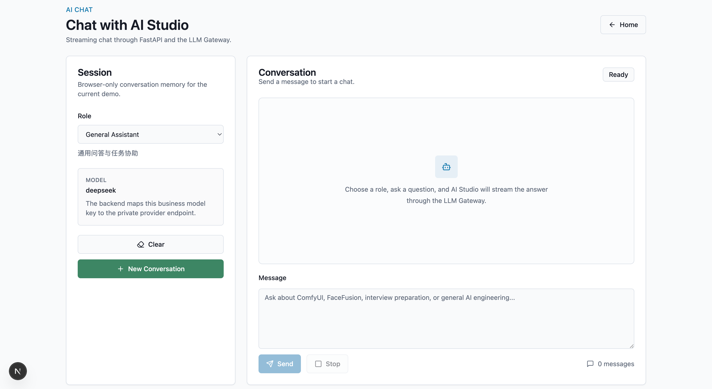
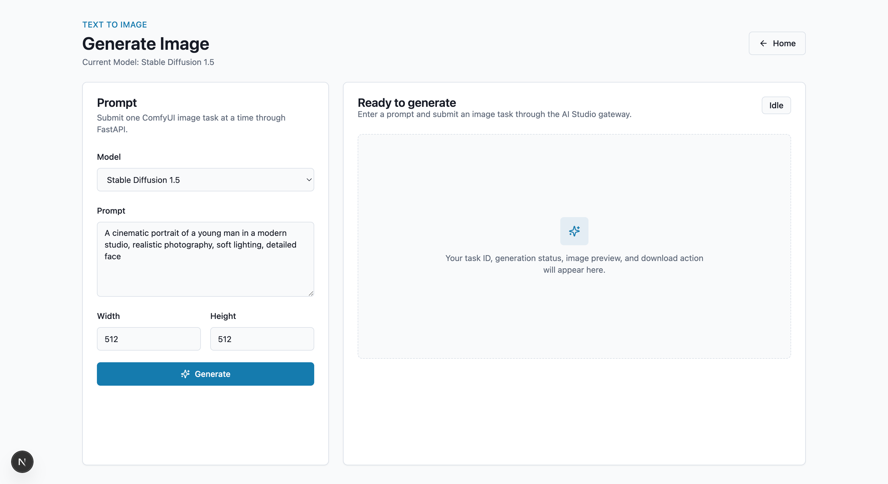
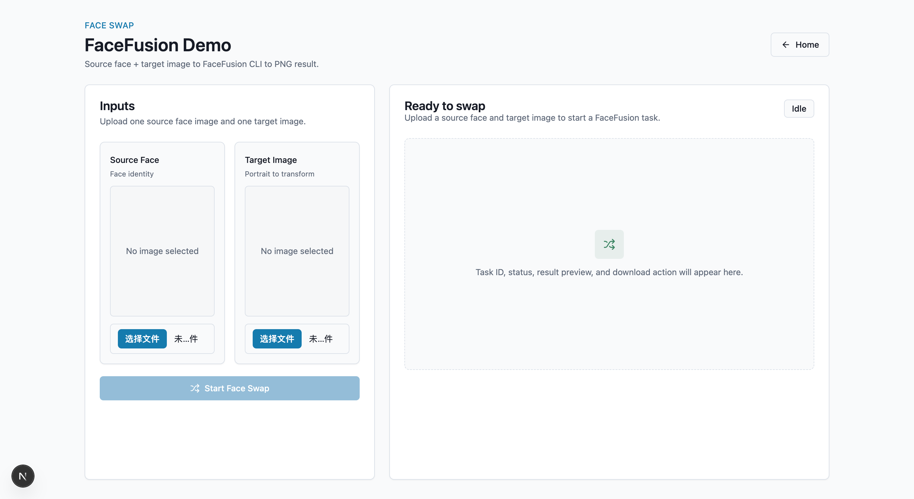
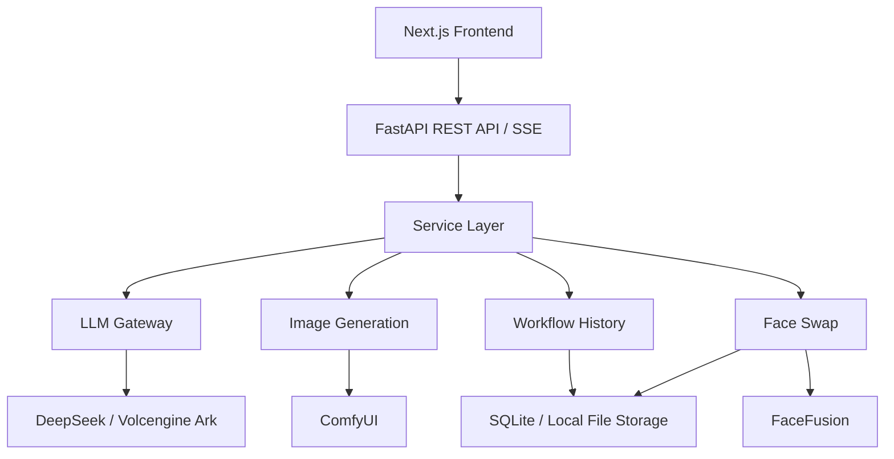

<p align="center">
  
</p>

<h1 align="center">
AI Studio
</h1>

<p align="center">
Enterprise AI Application Platform
</p>

<p align="center">
FastAPI • Next.js • ComfyUI • FaceFusion • DeepSeek • SQLite
</p>

<p align="center">
  
  
  
  
  
  
</p>

## Why AI Studio

Modern AIGC applications often need to integrate image generation engines, face editing pipelines, and large language models at the same time. These runtimes usually have different APIs, execution models, configuration formats, and operational boundaries.

AI Studio is not a wrapper around one model. It is a local application platform that unifies multiple AI runtimes behind a consistent FastAPI service layer and a focused Next.js workspace.

## Highlights

- **AI Chat**: role-based DeepSeek conversations with real SSE streaming.
- **Text to Image**: ComfyUI workflow submission with model registry selection.
- **Face Swap**: FaceFusion-backed image face swap workflow.
- **Workflow History**: unified records for image generation and face swap runs.
- **SQLite Persistence**: workflow records survive backend restarts.
- **Workspace Sidebar**: desktop Sidebar, mobile drawer, and recent workflow shortcuts.
- **Runtime Isolation**: ComfyUI, FaceFusion, and LLM provider details stay behind services, clients, registries, or executors.

## Screenshots

| Home | AI Chat |
| --- | --- |
|  |  |

| Text to Image | Face Swap |
| --- | --- |
|  |  |

## Architecture

All user-facing workflows enter through the Next.js workspace and FastAPI API layer. Endpoints stay thin; workflow behavior lives in services. Runtime-specific details stay isolated so ComfyUI, FaceFusion, and DeepSeek can evolve independently from the application surface.



## Design Principles

### Modular Services

Each AI capability is implemented by a dedicated service. `ChatService`, `ImageService`, `FaceSwapService`, `FileService`, and `WorkflowHistoryService` keep responsibilities clear.

### Runtime Isolation

Business logic is decoupled from runtime-specific details. ComfyUI integration lives behind an HTTP client and workflow loader, FaceFusion runs through an executor boundary, and DeepSeek is accessed through the LLM gateway.

### Registry Pattern

Registries manage runtime choices that need to stay configurable, including image models, workflow templates, LLM clients, and chat roles.

### Thin Controllers

FastAPI endpoints handle request/response boundaries and delegate orchestration to services.

### Configuration Driven

Runtime paths, provider URLs, model identifiers, file limits, timeouts, and SQLite location are managed through Pydantic Settings and local environment files.

## Features

### AI Chat

Chat with role-based assistants through the backend LLM Gateway. The frontend sends browser-session context, the backend injects the selected role prompt, and the client streams provider responses as SSE events.

Current roles:

- General Assistant
- AIGC Engineer
- Interview Coach

### Text to Image

Generate images through ComfyUI workflows. AI Studio selects the target model through a backend registry, loads the matching workflow template, submits the workflow to ComfyUI, polls task status, and returns the generated image for preview and download.

Current registry entries:

- Stable Diffusion 1.5
- FLUX.1 Schnell FP8, when the checkpoint is available locally

### Face Swap

Upload a source face and target image, create a face swap task, run FaceFusion through the executor boundary, then preview and download the result.

### Workflow History

Image generation and face swap runs are stored in SQLite and displayed in a unified History workspace. Sidebar Recent Workflows links open detail views with `/history?run_id=...`.

## Tech Stack

| Layer | Stack |
| --- | --- |
| Frontend | Next.js 15, React 19, TypeScript strict mode, Tailwind CSS, local shadcn-style primitives |
| Backend | Python 3.12, FastAPI, Pydantic Settings, SQLAlchemy, Uvicorn, pytest |
| Persistence | SQLite |
| Image Runtime | ComfyUI, SD1.5 workflow, FLUX workflow support |
| Face Runtime | FaceFusion CLI executor |
| LLM Runtime | DeepSeek through Volcengine Ark, OpenAI-compatible chat completions, SSE streaming |

## Project Structure

```text
AI-Studio/
├── backend/
│   ├── app/
│   │   ├── api/v1/endpoints/       # REST and SSE endpoint boundaries
│   │   ├── core/                   # Settings, database, logging
│   │   ├── executors/              # Mock and FaceFusion executors
│   │   ├── models/                 # SQLAlchemy models
│   │   ├── schemas/                # Pydantic schemas
│   │   └── services/
│   │       ├── comfyui/            # Client, workflow loader, image model registry
│   │       ├── files/              # FileService
│   │       ├── history/            # Workflow history repositories and service
│   │       ├── jobs/               # TaskManager
│   │       └── llm/                # LLM gateway, registry, clients, role registry
│   ├── tests/
│   ├── requirements.txt
│   └── requirements-dev.txt
├── frontend/
│   ├── app/                        # Next.js App Router pages
│   ├── components/                 # Workspace panels and UI primitives
│   ├── hooks/                      # Browser workflow state
│   ├── services/                   # API client functions
│   └── types/                      # TypeScript API types
├── data/
│   ├── uploads/                    # Ignored local upload storage
│   └── outputs/                    # Ignored local output storage
├── docs/
│   └── releases/
├── scripts/
├── assets/
└── README.md
```

## Quick Start

### 1. Clone

```bash
git clone https://github.com/STAJJJ/AI-Studio.git
cd AI-Studio
```

### 2. Backend Environment

Use your existing Conda environment. This project was validated locally with the `studio` environment.

```bash
conda activate studio
cd backend
pip install -r requirements-dev.txt
```

### 3. Frontend Dependencies

```bash
cd ../frontend
npm install
```

### 4. Local Configuration

Create a local environment file:

```bash
cd ..
cp .env.example .env
```

Review the runtime values in `.env`. Chat, Image Generation, and Face Swap require their corresponding local runtimes or provider credentials to be configured.

### 5. Start Both Services

```bash
./scripts/start-dev.sh
```

Open:

```text
Frontend: http://127.0.0.1:3000
Backend API docs: http://127.0.0.1:8002/docs
```

## Environment Variables

| Variable | Purpose |
| --- | --- |
| `AI_STUDIO_UPLOAD_DIR` | Local upload storage directory |
| `AI_STUDIO_OUTPUT_DIR` | Local Face Swap output directory |
| `AI_STUDIO_DATABASE_URL` | SQLite database URL |
| `AI_STUDIO_DEFAULT_IMAGE_MODEL` | Default image registry key, usually `sd15` |
| `AI_STUDIO_COMFYUI_BASE_URL` | ComfyUI HTTP API URL |
| `AI_STUDIO_COMFYUI_OUTPUT_DIR` | ComfyUI output directory used for result lookup |
| `AI_STUDIO_FACEFUSION_PROJECT_PATH` | Local FaceFusion project path |
| `AI_STUDIO_FACEFUSION_PYTHON_PATH` | Python executable used to run FaceFusion |
| `AI_STUDIO_FACEFUSION_EXECUTION_PROVIDER` | FaceFusion execution provider, for example `cpu` or `coreml` |
| `AI_STUDIO_LLM_BASE_URL` | OpenAI-compatible LLM provider base URL |
| `AI_STUDIO_LLM_API_KEY` | LLM provider API key. Never commit real keys |
| `AI_STUDIO_LLM_DEFAULT_MODEL` | Backend model or provider endpoint mapping |
| `AI_STUDIO_RUNTIME_GPU_NAME` | Display-only runtime label for the homepage |

## Run Services Separately

Backend:

```bash
conda activate studio
cd backend
python -m uvicorn app.main:app --host 127.0.0.1 --port 8002
```

Frontend:

```bash
cd frontend
AI_STUDIO_API_BASE_URL=http://127.0.0.1:8002 npm run dev -- --hostname 127.0.0.1 --port 3000
```

## Testing And Quality Checks

Run the full local check:

```bash
./scripts/check.sh
```

Or run each step manually:

```bash
cd backend
python -m pytest -q

cd ../frontend
npm run typecheck
npm run lint
npm run build
```

## API Documentation

When the backend is running:

```text
http://127.0.0.1:8002/docs
```

Health check:

```bash
curl http://127.0.0.1:8002/api/v1/health
```

## Data And Privacy

- `.env` files are ignored by Git.
- SQLite database files under `data/` are ignored by Git.
- Uploads and generated outputs under `data/uploads` and `data/outputs` are ignored by Git.
- Do not commit API keys, local model paths containing private information, uploaded user images, or generated private results.
- `tests/assets` contains only small test images required for automated tests.

## Current Limitations

- The project is a local portfolio application and does not include authentication or multi-user isolation.
- ComfyUI and FaceFusion are external local runtimes and are not installed by this repository.
- FLUX generation requires the corresponding local checkpoint.
- Chat requires a valid OpenAI-compatible DeepSeek provider configuration.
- Workflow History stores metadata in SQLite, not a production database.
- Docker deployment is intentionally out of scope for this release.

## Roadmap

### Completed

- v0.1: FastAPI backend architecture initialization
- v0.2: LLM Gateway foundation
- v0.3: File workflow and mock task lifecycle
- v0.4: FaceFusion executor validation
- v0.5: ComfyUI image generation integration
- v0.6: First Next.js web demo
- v0.7: End-to-end image generation workflow
- v0.8: End-to-end face swap workflow
- v0.9: Image model registry and dynamic workflow selection
- v0.10: End-to-end AI Chat with DeepSeek streaming
- v0.11: Unified Workflow History
- v0.12: SQLite persistence
- v0.13: Workspace Sidebar UI
- v1.0: Portfolio-ready release polish

### Planned

- Improve runtime setup diagnostics
- Add richer workflow detail views
- Add optional deployment guide
- Expand automated frontend tests

## Version History

| Version | Summary |
| --- | --- |
| v0.10.0 | Added end-to-end AI Chat with role registry, DeepSeek integration, SSE streaming, and multi-turn context. |
| v0.11.0 | Added unified Workflow History for image generation and face swap workflows. |
| v0.12.0 | Added SQLite persistence for workflow history. |
| v0.13.0 | Added Workspace Sidebar navigation and mobile drawer. |
| v1.0.0 | Portfolio-ready release polish, scripts, documentation, and validation package. |

## License

No license file is currently included in this repository. Add a license before distributing or reusing the project outside its current portfolio context.
