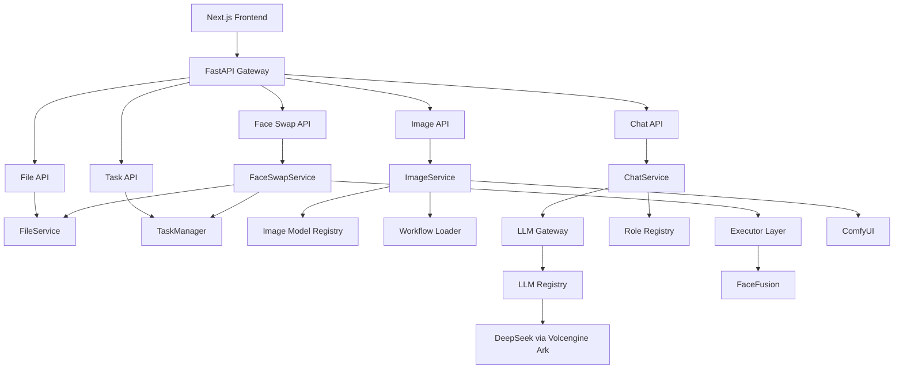

# AI Studio

**Enterprise AI Application Platform**

AI Studio is a unified AIGC application platform for image generation, face swap, and AI chat through a modular service-oriented architecture.

> TODO: Replace with project banner.
>
> Reserved asset: `assets/banner.png`


## Why AI Studio

Modern AIGC applications often need to integrate multiple AI runtimes at the same time:

- Image generation engines
- Face editing pipelines
- Large language models

These runtimes usually have different APIs, execution models, configuration formats, and operational boundaries. AI Studio is not designed to wrap a single model. Its goal is to provide a platform-oriented engineering structure that can unify these runtimes behind consistent application services.

The project focuses on platform design, runtime isolation, and maintainable architecture. Each AI capability is exposed through a web interface, routed through FastAPI, and implemented behind dedicated services, registries, gateways, or executors.

## Highlights

| Area | What it provides |
| --- | --- |
| Text-to-Image | Generate images through ComfyUI workflows and registry-managed model selection. |
| Face Swap | Execute end-to-end face swap workflows with upload, processing, preview, and download. |
| AI Chat | Interact with DeepSeek through real streaming conversations and role-based prompts. |
| Modular Architecture | Keep image, face, and chat capabilities isolated behind service boundaries. |
| Registry-based Management | Manage image models, workflows, LLM clients, and chat roles through registries. |
| Streaming LLM | Use upstream SSE streaming instead of simulated token streaming. |
| End-to-End Workflows | Connect browser UI, FastAPI APIs, service logic, and AI runtimes in one platform. |

## Architecture

AI Studio routes all user-facing workflows through a service layer. Image generation, face swap, and chat each have different runtime requirements, but the API layer stays consistent and lightweight. Runtime-specific details stay inside integration modules, so ComfyUI, FaceFusion, and DeepSeek can evolve independently from the application surface.



## Design Principles

### Modular Services

Each AI capability is implemented by a dedicated service. `ImageService`, `FaceSwapService`, and `ChatService` keep their workflow logic separate while sharing common API, file, task, and configuration patterns.

### Runtime Isolation

Business logic is decoupled from runtime-specific details. ComfyUI integration lives behind its client and workflow loader, FaceFusion runs through an executor boundary, and DeepSeek is accessed through the LLM gateway and client registry.

### Registry Pattern

Registries are used where runtime choices should remain configurable and extensible. The current codebase includes image model registry, LLM client registry, and chat role registry patterns.

### Thin Controllers

FastAPI endpoints stay lightweight. Request handling, validation orchestration, runtime calls, and response shaping are delegated to services.

### Streaming First

The chat workflow uses real upstream streaming from the LLM provider. The backend forwards SSE events to the frontend instead of waiting for a full response and splitting it locally.

### Configuration Driven

Runtime paths, provider URLs, model identifiers, file limits, timeout values, and environment-specific settings are managed through Pydantic Settings and local environment files.

## Screenshots

Real screenshots are not included in this repository snapshot.

TODO: Add screenshots after capturing the current local web UI.

| Page | Reserved asset |
| --- | --- |
| Homepage | `assets/homepage.png` |
| Image Generation | `assets/image-generation.png` |
| Face Swap | `assets/face-swap.png` |
| AI Chat | `assets/chat.png` |
| Architecture | `assets/architecture.svg` |

## Features

### Image Generation

Generate images through ComfyUI workflows from the web UI. AI Studio selects the target image model through a backend registry, loads the matching workflow template, submits the workflow to ComfyUI, and returns the generated image for preview and download.

Current model entries include Stable Diffusion 1.5 and FLUX.1 Schnell FP8 workflow support when the required checkpoint is available locally.

### Face Swap

Run image-based face swap workflows through the platform UI. Users upload source and target images, create a face swap task, wait for execution, preview the result, and download the output.

The runtime is isolated through `FaceFusionExecutor`, while file metadata and task state are handled by `FileService` and `TaskManager`.

### AI Chat

Chat with DeepSeek through an OpenAI-compatible backend gateway. The frontend sends a browser-session message context, the backend injects the selected role prompt, and the LLM client streams provider responses back through SSE.

The current role registry includes General Assistant, AIGC Engineer, and Interview Coach. The chat UI supports streaming output, stop generation, clear conversation, and new conversation controls.

## Tech Stack

| Layer | Stack |
| --- | --- |
| Frontend | Next.js 15, React 19, TypeScript strict mode, Tailwind CSS, local shadcn-style UI primitives |
| Backend | Python 3.12, FastAPI, Pydantic Settings, Uvicorn, pytest |
| Image Runtime | ComfyUI, Stable Diffusion 1.5 workflow, FLUX.1 Schnell FP8 workflow support |
| Face Runtime | FaceFusion executor integration |
| LLM Runtime | DeepSeek through Volcengine Ark, OpenAI-compatible chat completions, SSE streaming |
| Engineering | Router / Service / Executor / Registry layering, environment-driven configuration, unit tests |

## Project Structure

```text
AI-Studio/
├── backend/
│   ├── app/
│   │   ├── api/v1/endpoints/       # Thin REST endpoints
│   │   ├── core/                   # Settings and logging
│   │   ├── executors/              # Mock and FaceFusion executors
│   │   ├── schemas/                # Pydantic request/response models
│   │   └── services/
│   │       ├── comfyui/            # Client, workflow loader, image model registry
│   │       ├── files/              # FileService
│   │       ├── jobs/               # TaskManager
│   │       └── llm/                # LLM gateway, registry, clients, role registry
│   ├── tests/                      # Backend unit and integration tests
│   ├── requirements.txt
│   └── requirements-dev.txt
├── frontend/
│   ├── app/                        # Next.js App Router pages
│   ├── components/                 # Feature panels and shared UI components
│   ├── hooks/                      # Browser workflow state
│   ├── services/                   # API client functions
│   └── types/                      # TypeScript API types
├── data/
│   ├── uploads/                    # Local upload storage
│   └── outputs/                    # Local output storage
├── docs/                           # Technical design notes
├── assets/                         # Reserved GitHub presentation assets
├── workflows/
├── scripts/
├── prompts/
└── README.md
```

## Quick Start

### 1. Clone

```bash
git clone https://github.com/STAJJJ/AI-Studio.git
cd AI-Studio
```

### 2. Backend

Use the existing Conda environment for local development.

```bash
conda activate studio
cd backend
pip install -r requirements-dev.txt
```

Create local backend configuration from the example file:

```bash
cp ../.env.example .env
```

Configure the values needed for your local runtimes:

```env
AI_STUDIO_COMFYUI_BASE_URL=http://127.0.0.1:8188
AI_STUDIO_LLM_BASE_URL=https://ark.cn-beijing.volces.com/api/v3
AI_STUDIO_LLM_API_KEY=replace-with-your-api-key
AI_STUDIO_LLM_DEFAULT_MODEL=replace-with-your-endpoint-id
```

Run the backend:

```bash
uvicorn app.main:app --host 127.0.0.1 --port 8002
```

Health check:

```bash
curl http://127.0.0.1:8002/api/v1/health
```

Swagger:

```text
http://127.0.0.1:8002/docs
```

### 3. Frontend

```bash
cd frontend
npm install
npm run dev
```

Open:

```text
http://127.0.0.1:3000
```

The frontend proxies `/api/v1/*` requests to `http://127.0.0.1:8002` by default. Override it with `AI_STUDIO_API_BASE_URL` if needed.

### 4. Verification

Backend:

```bash
cd backend
python -m pytest -q
```

Frontend:

```bash
cd frontend
npm run typecheck
npm run build
```

## Roadmap

### Completed

- v0.1: FastAPI backend architecture initialization
- v0.2: LLM gateway with OpenAI-compatible chat API foundation
- v0.3: File workflow and mock face swap task lifecycle
- v0.4: FaceFusion executor integration
- v0.5: ComfyUI image generation integration
- v0.6: First Next.js web demo
- v0.7: End-to-end image generation workflow
- v0.8: End-to-end face swap workflow
- v0.9: Image model registry and dynamic workflow selection
- v0.10: End-to-end AI chat with DeepSeek streaming

### Planned

- v0.11: Browser-visible workflow records
- v0.12: Runtime status page
- v1.0: Stable release documentation and presentation package

## Version History

| Version | Summary |
| --- | --- |
| v0.1.0 | Initialized the FastAPI backend architecture, configuration, health check, and project structure. |
| v0.2.0 | Added the LLM gateway, client registry, and OpenAI-compatible chat API foundation. |
| v0.3.0 | Added file management, task lifecycle management, and mock face swap workflow execution. |
| v0.4.0 | Integrated FaceFusion executor validation through CLI-based execution. |
| v0.5.0 | Integrated ComfyUI image generation through HTTP workflow submission. |
| v0.6.0 | Added the first Next.js web demo with homepage and image generation page. |
| v0.7.0 | Completed the end-to-end image generation workflow with polling, preview, and download. |
| v0.7.1 | Polished the image generation experience and fixed repeated prompt output handling. |
| v0.8.0 | Completed the end-to-end face swap workflow with upload, polling, preview, and download. |
| v0.8.1 | Polished the face swap page styling. |
| v0.9.0 | Added image model registry and dynamic workflow selection for SD1.5 and FLUX. |
| v0.10.0 | Added end-to-end AI chat with role registry, DeepSeek integration, SSE streaming, and multi-turn context. |

## License

No license file is currently included in this repository. Add a license before distributing or reusing the project outside its current portfolio context.
