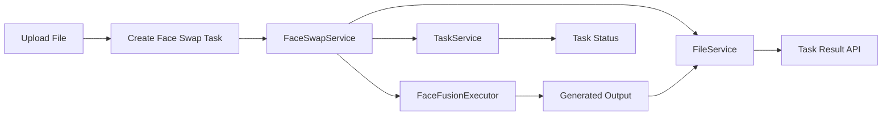

# AI Studio v0.3 Technical Design

## 1. Direction Update

AI Studio v0.3 changes the product center from a chat-first AI application to an AI portrait and face-swap creation platform. The LLM Gateway from v0.2 remains part of the platform, but its role becomes supporting Prompt Assistant capabilities instead of being the main user-facing product.

The v0.3 priority order is:

1. FaceFusion Integration
2. ComfyUI Integration
3. AI Workflow
4. Prompt Assistant powered by the existing LLM Gateway

This document is a technical design only. It does not start implementation.

## 2. Architecture Principles

The existing FastAPI structure should stay consistent:

- Endpoint layer handles HTTP request parsing, response serialization, and error translation only.
- Service layer owns business orchestration.
- External AI engines are wrapped behind client or adapter classes.
- Long-running work is represented as tasks, not blocking API calls.
- Gateway-style boundaries are kept for external AI capability access.

FaceFusion should not be called directly from endpoints. The endpoint should call `FaceSwapService`, and `FaceSwapService` should coordinate storage, validation, task creation, execution adapter, and result persistence.

Proposed future module layout:

```text
backend/app/
├── api/v1/endpoints/
│   ├── face_swap.py
│   └── files.py
├── schemas/
│   ├── face_swap.py
│   └── task.py
├── services/
│   ├── face_swap_service.py
│   ├── task_service.py
│   ├── file_service.py
│   ├── facefusion/
│   │   ├── client.py
│   │   ├── config.py
│   │   └── executor.py
│   └── workflows/
│       ├── base.py
│       ├── face_swap_workflow.py
│       └── comfyui_workflow.py
└── utils/
    └── file_validation.py
```

This keeps FaceFusion integration isolated and leaves space for ComfyUI without coupling the two engines.

## 3. FaceFusion Integration

FaceFusion should be treated as an external engine behind an internal adapter. The adapter should hide whether FaceFusion is executed through CLI, Python module, container command, or a future service API.

Initial design:

```text
FaceSwapService
  -> TaskService
  -> FileService
  -> FaceFusionClient
       -> FaceFusionExecutor
            -> FaceFusion CLI or process execution
```

Responsibilities:

- `FaceFusionClient`: stable Python interface used by AI Studio services.
- `FaceFusionExecutor`: low-level execution details, process arguments, working directory, timeout, stderr/stdout capture.
- `FaceFusionConfig`: paths, model settings, execution timeout, output directory, GPU options.

The first implementation can use asynchronous task tracking with a simple in-memory store or filesystem-backed metadata. A database should not be introduced in v0.3 unless explicitly required later.

FaceFusion execution should be task-based because face swapping is GPU-bound and can take seconds or minutes. The API should return a `task_id` immediately instead of blocking the HTTP request until the output is complete.

## 4. FaceSwapService Design

`FaceSwapService` is the main business boundary for face swap creation.

Core responsibilities:

- Validate uploaded source face image and target image or video.
- Create a task record with status `pending`.
- Persist input file metadata and normalized file paths.
- Dispatch execution through `FaceFusionClient`.
- Update task status to `running`, `succeeded`, or `failed`.
- Store output metadata when generation succeeds.
- Expose task status and result lookup to API endpoints.

Suggested service methods:

```python
class FaceSwapService:
    def create_task(self, request: FaceSwapCreateRequest) -> FaceSwapTaskResponse: ...
    def get_task(self, task_id: str) -> FaceSwapTaskResponse: ...
    def get_result(self, task_id: str) -> FaceSwapResult: ...
```

Task status model:

```text
pending   -> task accepted but not started
running   -> FaceFusion execution in progress
succeeded -> output generated and available
failed    -> execution failed with recorded error
canceled  -> reserved for future cancellation support
```

The service should not expose FaceFusion-specific command details to the API layer. This preserves the ability to replace FaceFusion execution with another backend later.

## 5. Upload API Design

Uploads should be explicit and validated before task creation. The platform needs to support at least two input categories:

- Source face image
- Target image or target video

Recommended RESTful file API:

```http
POST /api/v1/files
Content-Type: multipart/form-data
```

Form fields:

```text
file: UploadFile
purpose: source_face | target_image | target_video
```

```http
GET /api/v1/files/{id}
```

Returns file metadata for uploaded inputs and generated outputs.

```http
DELETE /api/v1/files/{id}
```

Deletes a file record and its physical artifact when deletion is allowed. Files referenced by running tasks should not be deleted.

Response:

```json
{
  "file_id": "file_...",
  "filename": "source.png",
  "content_type": "image/png",
  "purpose": "source_face",
  "size_bytes": 123456,
  "storage_path": "data/uploads/file_.../source.png"
}
```

Validation rules:

- Source face accepts image types only.
- Target accepts image or video depending on purpose.
- File size should be capped by config.
- Filenames should be sanitized.
- Actual storage path should be generated by server, not trusted from client input.

This keeps file upload reusable for FaceFusion now and ComfyUI later.

## 6. Face Swap Task API Design

Task creation should reference uploaded file IDs rather than receiving raw files directly. This makes the workflow explicit and easier to resume, inspect, and extend.

```http
POST /api/v1/face-swap/tasks
Content-Type: application/json
```

Request:

```json
{
  "source_file_id": "file_source",
  "target_file_id": "file_target",
  "options": {
    "execution_provider": "facefusion",
    "output_format": "png"
  }
}
```

Response:

```json
{
  "task_id": "task_...",
  "status": "pending",
  "provider": "facefusion",
  "created_at": 1783584000,
  "updated_at": 1783584000
}
```

Endpoint responsibilities:

- Parse request body.
- Call `FaceSwapService.create_task()`.
- Return typed response.
- Convert domain errors to HTTP status codes.

The endpoint should not perform file lookup, task persistence, or FaceFusion argument construction.

## 7. Task Status Query API Design

Clients need a stable way to poll progress.

```http
GET /api/v1/tasks/{task_id}
```

Response while running:

```json
{
  "task_id": "task_...",
  "type": "face_swap",
  "status": "running",
  "progress": 35,
  "message": "FaceFusion processing",
  "created_at": 1783584000,
  "updated_at": 1783584060,
  "result": null,
  "error": null
}
```

Response after success:

```json
{
  "task_id": "task_...",
  "type": "face_swap",
  "status": "succeeded",
  "progress": 100,
  "message": "Completed",
  "result": {
    "file_id": "file_output",
    "download_url": "/api/v1/tasks/task_.../result"
  },
  "error": null
}
```

Response after failure:

```json
{
  "task_id": "task_...",
  "type": "face_swap",
  "status": "failed",
  "progress": 100,
  "message": "Failed",
  "result": null,
  "error": {
    "code": "FACEFUSION_EXECUTION_FAILED",
    "message": "FaceFusion process exited with non-zero status"
  }
}
```

Task status should be generic enough for future ComfyUI workflows. A single `TaskService` should support multiple task types instead of creating task logic inside each endpoint.

## 8. Result Download API Design

Generated outputs should be downloaded through controlled API endpoints, not by exposing raw filesystem paths.

```http
GET /api/v1/tasks/{task_id}/result
```

Responsibilities:

- Resolve `task_id` to a completed task.
- Resolve the task result to a stored output file.
- Verify file exists and belongs to an output artifact.
- Return `FileResponse` or streaming response.
- Set safe filename and content type.
- Return a clear domain error if the task is still pending, running, failed, or has no output.

Possible response headers:

```text
Content-Type: image/png
Content-Disposition: attachment; filename="face_swap_result.png"
```

The result endpoint should use `FileService`, not direct path manipulation in the route.

## 9. Execution Flow

The v0.3 workflow should be task-oriented from upload through result retrieval. The API layer stays thin while services and executors own orchestration and engine-specific execution.



Flow notes:

1. `POST /api/v1/files` stores source and target assets through `FileService`.
2. `POST /api/v1/face-swap/tasks` creates a task and delegates orchestration to `FaceSwapService`.
3. `FaceSwapService` loads file metadata, creates or updates task state, and calls `FaceFusionExecutor` through the FaceFusion adapter boundary.
4. `FaceFusionExecutor` runs the external engine and writes output artifacts.
5. `FileService` records generated output metadata.
6. `GET /api/v1/tasks/{task_id}` exposes state, while `GET /api/v1/tasks/{task_id}/result` returns the final artifact after success.

## 10. Future ComfyUI Workflow Integration

ComfyUI should be introduced as another workflow execution backend, not mixed into FaceFusion internals.

Future design:

```text
WorkflowService
  -> WorkflowRegistry
       face_swap.facefusion -> FaceFusionWorkflow
       image.generate.comfyui -> ComfyUIWorkflow
       portrait.generate.comfyui -> ComfyUIWorkflow
```

Each workflow should expose a consistent contract:

```python
class BaseWorkflow:
    workflow_type: str

    def create_task(self, payload: dict) -> TaskRecord: ...
    def run(self, task_id: str) -> None: ...
```

ComfyUI integration can later support:

- Loading workflow JSON templates.
- Injecting prompt, seed, model, LoRA, ControlNet, and input images.
- Calling ComfyUI queue APIs.
- Polling ComfyUI history APIs.
- Mapping ComfyUI output files into AI Studio `FileService`.

FaceFusion and ComfyUI can share:

- Upload API
- TaskService
- FileService
- Result download API
- Workflow status model

They should not share engine-specific runner code.

## 11. Alignment With Existing LLM Gateway

The existing LLM Gateway remains valuable, but its role changes.

New role:

- Prompt Assistant generates better prompts for ComfyUI portrait workflows.
- Prompt Assistant can transform user intent into structured workflow inputs.
- Gateway still keeps GPT, Qwen, DeepSeek, and future Claude/Gemini/Kimi clients behind one interface.

Consistency rules:

- LLM Gateway uses `Gateway + Registry + Client`.
- Workflow execution should mirror the same idea with `WorkflowService + WorkflowRegistry + Workflow`.
- External engines should stay behind service/client boundaries.
- API endpoints should remain thin.

This creates a unified platform architecture:

```text
HTTP API
  -> Service Layer
      -> Registry
          -> Client or Workflow Adapter
              -> External AI Engine
```

For v0.3, FaceFusion can be the first non-LLM external AI engine following the same architectural principle.

## 12. Suggested v0.3 Scope Boundary

Recommended v0.3 implementation scope after this design is reviewed:

- Add upload API.
- Add generic task status API.
- Add result download API.
- Add FaceSwapService.
- Add FaceFusion client and runner abstraction.
- Use mock or dry-run FaceFusion execution first if the real binary path is not stable.
- Keep ComfyUI as design-only unless explicitly approved for implementation.

Out of scope for v0.3 unless separately approved:

- Frontend pages.
- Database integration.
- Docker changes.
- Real Prompt Assistant behavior.
- Full ComfyUI execution.
- Payment, user system, authentication, or history UI.

## 13. Future Extensions

### ComfyUI

ComfyUI should be added as a workflow executor, not as logic inside FaceSwapService. A future `ComfyUIExecutor` can own queue submission, workflow JSON injection, polling, and output collection. It should reuse `FileService`, `TaskService`, and the generic workflow status model.

### Video Generation

Video generation should use the same task-based contract because generation is long-running and GPU-bound. A future video workflow can accept uploaded reference images, prompt metadata, model parameters, and output format options, then expose progress through `GET /api/v1/tasks/{task_id}` and output through `GET /api/v1/tasks/{task_id}/result`.

### Multiple Face Providers

FaceFusion should be the first face provider, but the architecture should allow alternatives such as InsightFace-based pipelines, Roop-style adapters, or commercial APIs. A future `FaceProviderRegistry` or workflow registry can map provider names to executors while keeping `FaceSwapService` stable.

Potential provider examples:

- `facefusion` through `FaceFusionExecutor`
- `insightface` through `InsightFaceExecutor`
- `remote_face_api` through a hosted API client

The endpoint contract should remain stable even when the execution provider changes.

## 14. Review Questions

Before implementation, confirm these points:

1. Should v0.3 call a real local FaceFusion installation, or start with a dry-run adapter?
2. Should tasks be stored in memory, JSON files, or wait for a database phase?
3. What file size limits should uploads use for image and video?
4. Should v0.3 support image-to-image face swap only, or include video targets too?
5. Should `/api/v1/tasks/{task_id}` and `/api/v1/tasks/{task_id}/result` be generic from the start, or should v0.3 initially scope task APIs under face swap?
